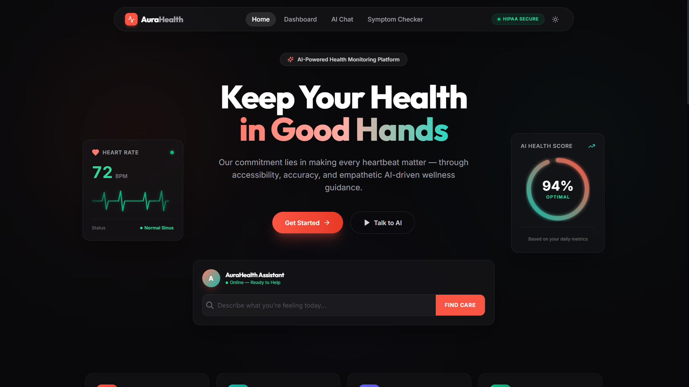
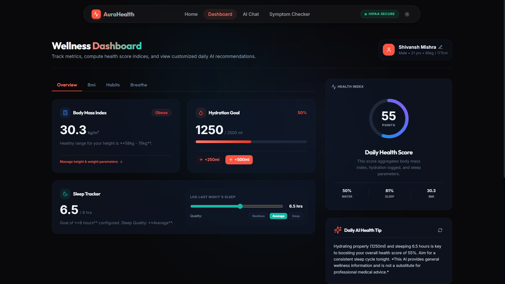
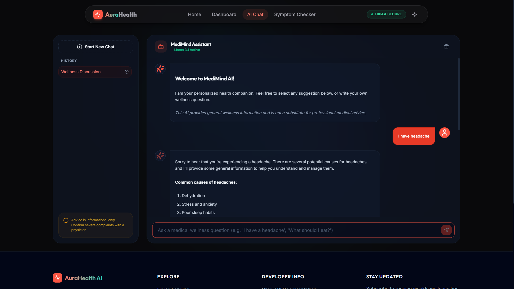
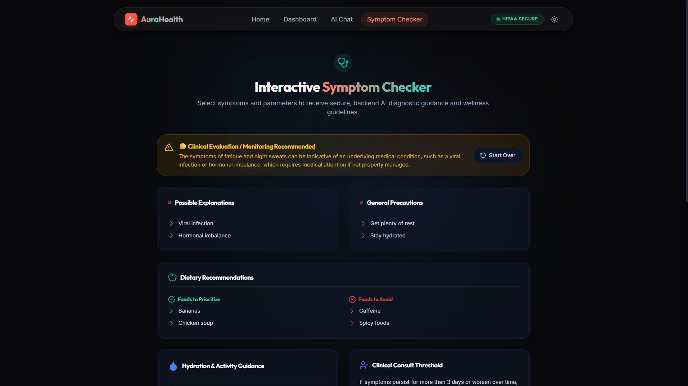

<div align="center">
  <h1>AuraHealth AI</h1>
  <p>An intelligent, empathetic wellness companion platform designed to help users track their health metrics, analyze symptoms, and interact with an AI health assistant.</p>
</div>

---

## 📸 Platform Previews

### Landing Page
Get started with our AI-powered health monitoring platform.


### Wellness Dashboard
Track metrics, compute health score indices, and view customized daily AI recommendations.



### AI Wellness Chat
Interact with MediMind Assistant to get personalized wellness guidance.


### Interactive Symptom Checker
Select symptoms and parameters to receive secure, backend AI diagnostic guidance and wellness guidelines.



## ✨ Features

- **Intent-Based Dashboard**: Track hydration, sleep, and BMI with an intuitive interface. Receive a Daily Health Score.
- **AI Wellness Chat**: Get real-time, personalized wellness advice using Groq's high-performance LLM APIs (Llama 3.1).
- **Symptom Checker**: Enter symptoms to receive a structured analysis, possible causes, precautions, and dietary recommendations.
- **Cloud Authentication & Database**: Secure Email/Password login and real-time user profile syncing powered by Firebase Auth & Firestore.
- **Premium UI**: Designed with an accessible, high-contrast dark glassmorphic aesthetic using Tailwind CSS and Framer Motion.

## 🚀 Quick Start

### 1. Clone the repository
```bash
git clone https://github.com/yourusername/HEALTH_CARE.git
cd HEALTH_CARE
```

### 2. Install dependencies
```bash
npm install
```

### 3. Environment Setup
Create a `.env` file in the project root and add your Groq API key and Firebase configurations:
```env
GROQ_API_KEY=your_groq_api_key_here
PORT=5000

# Firebase Configuration
VITE_FIREBASE_API_KEY=your_api_key
VITE_FIREBASE_AUTH_DOMAIN=your_project.firebaseapp.com
VITE_FIREBASE_PROJECT_ID=your_project
VITE_FIREBASE_STORAGE_BUCKET=your_project.appspot.com
VITE_FIREBASE_MESSAGING_SENDER_ID=your_sender_id
VITE_FIREBASE_APP_ID=your_app_id
VITE_FIREBASE_MEASUREMENT_ID=your_measurement_id
```

### 4. Run the development server
```bash
npm run dev
```
This will start both the Express backend (port 5000) and the Vite frontend (port 3000) concurrently.

## 🏗 Architecture
```
src/
├── app/          # App setup, context providers, routing
├── assets/       # Styles, images
├── components/   # Shared layout and UI components
├── features/     # Domain-specific pages (chat, dashboard, landing, symptoms)
├── hooks/        # Custom React hooks
└── lib/          # API client and constants
server/
└── index.js      # Express backend handling Groq API integration
```

## 🛠 Tech Stack
- **Frontend**: React 18, Vite, React Router, Tailwind CSS, Framer Motion
- **Backend**: Node.js, Express
- **Database & Auth**: Firebase (Firestore & Authentication)
- **AI Integration**: Groq SDK (`llama-3.1-8b-instant`)

## 📜 License
MIT License
